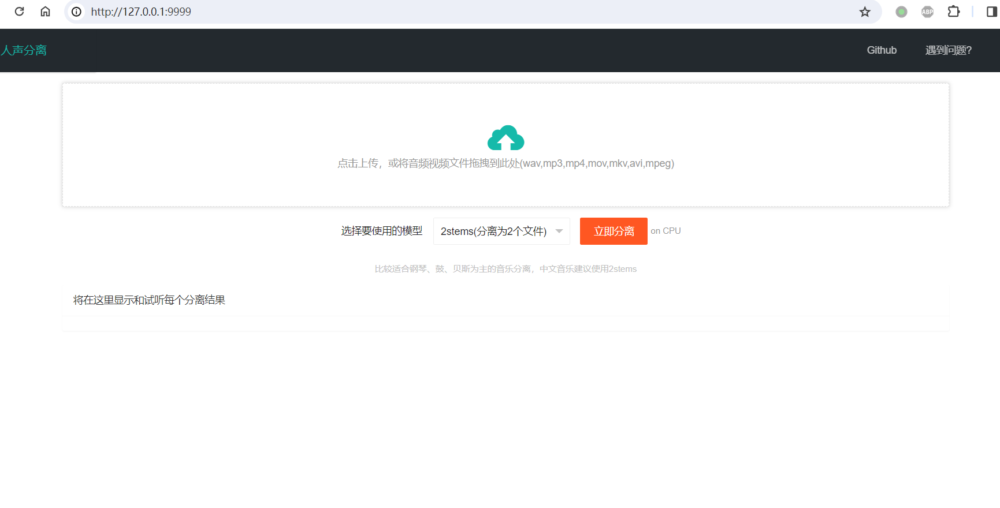

[English README](./README_EN.md)  / [Discord](https://discord.gg/TMCM2PfHzQ) / QQ群 902124277

# Music Vocal Separation Tool

This is an extremely simple tool for separating vocals and background music, completely localized for web operation,  using 2stems/4stems/5stems models.

> 
> Drag and drop a song or an audio/video file with background music into the local web page, and you can separate the vocals and music into separate audio wav files. You can choose to separate "piano sound," "bass sound," "drum sound," etc.
> 
> Automatically invoke the local browser to open the local web page, and the model is built-in, no need to connect to the external network to download.
> 
> Supports video (mp4/mov/mkv/avi/mpeg) and audio (mp3/wav) formats
> 
> Just two clicks of the mouse, one to select the audio/video file, and two to start processing.
> 

# Video Demo

https://github.com/jianchang512/clone-voice/assets/3378335/4e63f2ac-cc68-4324-a4d9-ecf4d4f81acd

# Precompiled Version Usage Instructions / Linux and Mac Source Deployment

1. Download the precompiled file from [Releases](https://github.com/jianchang512/vocal-separate/releases) on the right side.

2. After downloading, unzip it to a certain location, such as E:/vocal-separate.

3. Double-click `start.exe`, wait for the browser window to open automatically.

4. Click on the upload area on the page, find the audio/video file you want to separate in the pop-up window, or drag the audio file directly to the upload area, and then click "Separate Now." Wait a moment, and at the bottom, each separated file and the playback control will be displayed. Click to play.

5. If the machine has an NVIDIA GPU and the CUDA environment is configured correctly, CUDA acceleration will be used automatically.

# Source Code Deployment (Linux/Mac/Windows)

0. Requires python 3.9->3.11

1. Create an empty directory, such as E:/vocal-separate. Open a cmd window in this directory, the method is to enter `cmd` in the address bar, and then press Enter.

	Use git to pull the source code to the current directory ` git clone git@github.com:jianchang512/vocal-separate.git . `

2. Create a virtual environment `python -m venv venv`

3. Activate the environment. On Windows, the command is `%cd%/venv/scripts/activate`, and on Linux and Mac, the command is `source ./venv/bin/activate`

4. Install dependencies: `pip install -r requirements.txt`

5. On Windows, unzip ffmpeg.7z and place `ffmpeg.exe` and `ffprobe.exe` in the project directory. On Linux and Mac, download the corresponding version of ffmpeg from [ffmpeg official website](https://ffmpeg.org/download.html), unzip it, and place the `ffmpeg` and `ffprobe` binary programs in the project root directory.

6. 下载模型压缩包，在项目根目录下的 `pretrained_models` 文件夹中解压，解压后，`pretrained_models`中将有3个文件夹，分别是`2stems`/`3stems`/`5stems`

6. Execute `python  start.py`, and wait for the local browser window to open automatically.

# CUDA Acceleration Support

**Install CUDA Toolkit**

If your computer has an Nvidia graphics card, upgrade the graphics card driver to the latest version, and then go to install the corresponding
   [CUDA Toolkit 11.8](https://developer.nvidia.com/cuda-downloads)  and  [cudnn for CUDA11.X](https://developer.nvidia.com/rdp/cudnn-archive).
   
   After the installation is complete, press `Win + R`, enter `cmd`, and then press Enter. In the popped up window, enter `nvcc --version` to confirm that there is version information displayed, similar to the picture
   

   Then continue to enter `nvidia-smi`, confirm that there is output information, and you can see the CUDA version number, similar to the picture
   

# Notes

0. For Chinese music or Chinese musical instruments, it is recommended to choose the `2stems` model. Other models can separately extract files for "piano, bass, and drums."
1. If the computer does not have an NVIDIA graphics card or has not configured the CUDA environment, do not choose the 4stems and 5stems models, especially when processing long-duration audio, otherwise, it may run out of memory.

# Acknowledgments

This project mainly relies on other projects

1. https://github.com/deezer/spleeter
2. https://github.com/pallets/flask
3. https://ffmpeg.org/
4. https://layui